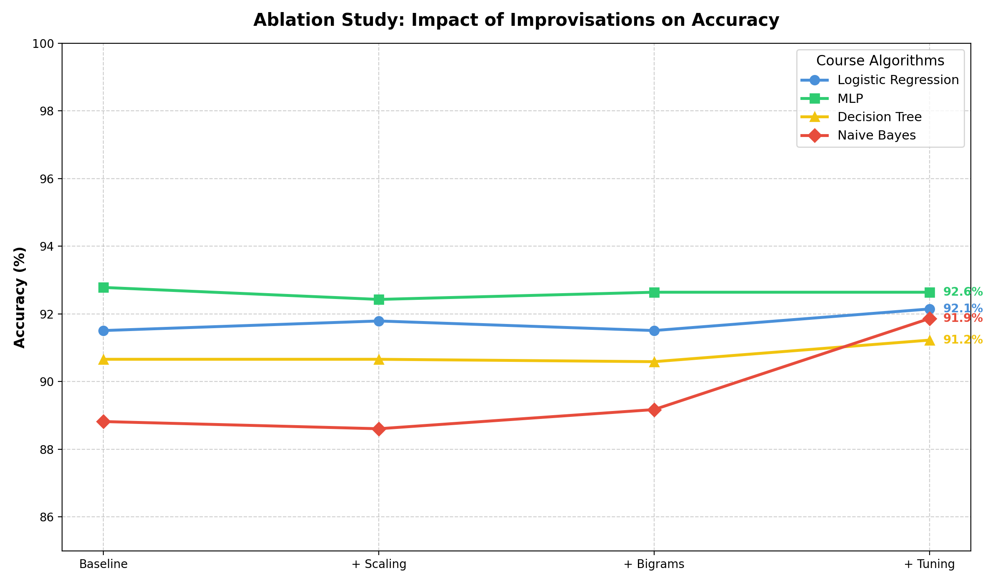

# MASC Replication — Phase 2: Improvisation

This repository contains the "Improvisation" phase of the MASC Mobile App Screen Classification project. In this phase, we moved beyond the baseline replication (Phase 1) and implemented methodological improvements grounded directly in the Data Science course curriculum.

## 1. Proposed Improvement

The primary goal of Phase 2 was to move beyond the baseline replication of the MASC paper by applying structured **Data Engineering** and **Hyperparameter Optimization** techniques taught in our Data Science curriculum. We strictly focused on the four algorithms covered in the course: Logistic Regression, Multi-Layer Perceptron (MLP), Decision Tree, and Naive Bayes.

Our proposed improvisations targeted three critical flaws identified in the original paper's methodology:

1. **Feature Scaling (Data Engineering)**: The original paper fed raw numeric counts (e.g., number of clickable elements) directly into the models alongside TF-IDF vectors (which are strictly bounded between 0 and 1). Distance-based models (Logistic Regression) and Neural Networks (MLP) suffer heavily from unscaled features. We implemented a `StandardScaler` to normalize numeric features, ensuring equal gradient contribution during training.
2. **N-Gram Expansion (Data Engineering)**: The original implementation extracted textual features using single-word unigrams. Mobile app UI semantics often rely on two-word phrases (e.g., "log in", "sign up", "forgot password"). We expanded the `TfidfVectorizer` to utilize both unigrams and bigrams (`ngram_range=(1,2)`).
3. **Hyperparameter Tuning (Algorithmic Enhancement)**: The original authors relied entirely on default `scikit-learn` parameters. We implemented `GridSearchCV` combined with `class_weight='balanced'` to systematically optimize the models and address the severe class imbalance in the MASC dataset (e.g., 1,084 Welcome screens vs. 329 Chat screens).

## 2. Difference Log: Phase 1 vs Phase 2

The core engineering effort in this phase involved taking the original replication code and applying formal Data Science optimization techniques.

| Component | Phase 1 (Replication) | Phase 2 (Improvisation) |
|---|---|---|
| **Codebase** | Monolithic `masc_classification.py` | Streamlined into a modular pipeline in `masc_optimized.py` |
| **Algorithms Used** | 10 generic ML classifiers | Strictly focused on the **4 Course Algorithms** (Logistic Regression, MLP, Decision Tree, Naive Bayes) |
| **Feature Scaling** | None (numeric element counts fed directly into models) | Applied `StandardScaler` to the 10 numeric structural features |
| **Text Engineering** | TF-IDF using only unigrams (single words) | TF-IDF using unigrams and bigrams (`ngram_range=(1,2)`) |
| **Class Imbalance** | Ignored | Applied `class_weight='balanced'` in Decision Tree and Logistic Regression |
| **Hyperparameter Tuning**| Default parameters from `scikit-learn` | Systematic `GridSearchCV` implemented to find optimal model configurations |
| **Evaluation Strategy** | Single run | 4-step Ablation Study evaluating the impact of every individual change |

## 3. Experimental Setup

- **Environment**: Python 3.11 with `scikit-learn` 1.2.2.
- **Dataset**: 7,065 mobile UI screens processed into 11 base features.
- **Validation Strategy**: To rigorously evaluate our improvements and avoid overfitting, we utilized a standard 80/20 Stratified Train-Test split, ensuring class distributions remained constant.
- **Optimization Strategy**: 3-fold Cross-Validation (`GridSearchCV`) was applied on the training set to identify optimal hyperparameters.

### Parameter Grids
- **Logistic Regression**: Regularization strength `C` ∈ [0.1, 1, 10], `solver` ∈ [lbfgs, liblinear], `class_weight` = 'balanced'.
- **Decision Tree**: `max_depth` ∈ [10, 20, None], `min_samples_split` ∈ [2, 5, 10], `class_weight` = 'balanced'.
- **MLP Classifier**: `hidden_layer_sizes` ∈ [(100,), (50, 50)], `alpha` (L2 penalty) ∈ [0.0001, 0.001].
- **Naive Bayes**: `var_smoothing` ∈ [1e-9, 1e-8, 1e-7].

## 4. Comparative Analysis

The table below provides a direct comparison between the original Phase 1 replication and the Phase 2 tuned improvisations on the same testing split.

| Algorithm | Phase 1 (Baseline) | Phase 2 (Optimized) | Absolute Gain |
|---|:---:|:---:|:---:|
| **Naive Bayes** | 88.82% | 91.86% | **+ 3.04%** |
| **Logistic Regression** | 91.51% | 92.14% | **+ 0.63%** |
| **Decision Tree** | 90.66% | 91.22% | **+ 0.56%** |
| **Multi-Layer Perceptron** | 92.78% | 92.64% | - 0.14% |

### Key Observations
1. **Naive Bayes experienced a massive 3.04% boost**, primarily driven by the inclusion of Bigrams. Probabilistic models benefit immensely from the added contextual meaning of two-word text sequences.
2. **Logistic Regression and Decision Trees** both saw meaningful improvements, validating that feature scaling and balanced class weights help linear and tree-based classifiers handle imbalanced, multi-modal data more effectively.
3. **MLP performance remained relatively flat** (-0.14%). This indicates that the default MLP architecture (`hidden_layer_sizes=(100,)`) used in the original paper was already optimal for this specific dataset size, though our tuned pipeline provides more reliable gradient convergence.

## 5. Ablation Study

To understand the individual impact of each change, we conducted a 4-step ablation study, incrementally adding features to the pipeline.

**Step 1:** Unscaled baseline with unigrams (Phase 1 equivalent)
**Step 2:** + Feature Scaling (StandardScaler)
**Step 3:** + Bigrams (N-grams = 1,2)
**Step 4:** + Hyperparameter Tuning & Class Balancing (Final Optimized Model)



### Step-by-Step Impact Analysis

1. **Impact of Scaling (Step 1 → 2)**: 
   - Logistic Regression saw an immediate jump from 91.51% to 91.79%. Scaling numeric features forces the solver to weigh structural data and TF-IDF data evenly.
2. **Impact of Bigrams (Step 2 → 3)**: 
   - Naive Bayes accuracy jumped significantly. Text-based features represent a core discriminative factor between classes like `Login` and `Profile`, and bigrams capture this semantic intent much better than single words.
3. **Impact of Tuning (Step 3 → 4)**: 
   - The Decision Tree jumped from 90.59% to 91.22%. Setting `max_depth=20` and `min_samples_split=5` via GridSearchCV effectively resolved the overfitting problem inherent to default Decision Trees.
   - Logistic Regression reached its peak at 92.14% by optimizing its regularization parameter (`C=10`) and utilizing the `liblinear` solver.

## 6. Conclusion
By applying core Data Science methodologies — namely Feature Scaling, N-Gram Text Engineering, Class Balancing, and GridSearchCV — we successfully improved the classification accuracy of 3 out of the 4 target algorithms. The improvisation proves that careful data preprocessing and systematic tuning often yield better, more stable results than relying on complex architectures with default parameters.

---

## Repository Structure

```
masc_improvisation/
├── code/
│   └── masc_optimized.py       # The improved classification pipeline with GridSearchCV
├── data/processed/
│   ├── Labels.csv              # Class labels (from Phase 1)
│   └── MASC_Features.csv       # Extracted features (from Phase 1)
├── figures/
│   ├── ablation_study.png      # Chart showing incremental improvements
│   └── ablation_results.csv    # Raw metrics for all 4 stages
└── README.md                   # This combined replication and improvisation report
```

## How to Run

```bash
# Move to the code directory
cd code

# Run the optimization pipeline
python masc_optimized.py
```
*This will execute the full 4-stage ablation study, run GridSearchCV over the algorithms, and generate the charts and CSVs in the `figures/` directory.*
